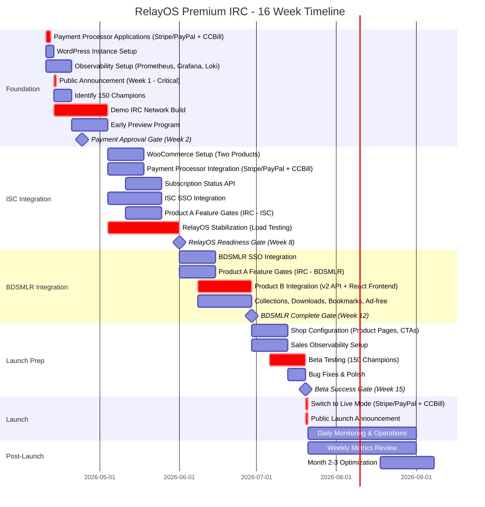

# RelayOS Premium IRC: Gantt Chart
## 16-Week Implementation Timeline

**Version:** 2.0  
**Date:** April 10, 2026  
**Based on:** ACTION_PLAN_V2.md

---

## Mermaid Gantt Chart



---

## How to View the Mermaid Chart:

### **Option 1: Mermaid Live Editor**
1. Go to: https://mermaid.live
2. Copy the code between \`\`\`mermaid and \`\`\`
3. Paste into editor
4. Export as PNG or SVG

### **Option 2: VS Code / Cursor**
1. Install "Markdown Preview Mermaid Support" extension
2. Open this file
3. Click "Preview" button
4. Chart renders automatically

### **Option 3: GitHub / GitLab**
1. Push this file to repository
2. Open on GitHub/GitLab
3. Mermaid renders automatically

---

## Markdown Table: Week-by-Week Timeline

| Week | Phase | Epic | Tasks | Owner | Gate/Milestone |
|------|-------|------|-------|-------|----------------|
| **0** | Foundation | Payments + SaaS Ops | • Apply to Stripe/PayPal<br>• Apply to CCBill<br>• WordPress setup<br>• Observability setup begins | Product Owner + Manager | |
| **1** | Foundation | Launch + SaaS Dev | • **PUBLIC ANNOUNCEMENT** ✅<br>• Identify 150 champions<br>• Demo IRC network build begins<br>• Observability operational | Product Owner + Developer + Manager | |
| **2** | Foundation | Launch + SaaS Dev | • Early Preview program<br>• Demo IRC network continues<br>• Survey champions | Product Owner + Developer | **Gate 1: Payment Approved** ✅ |
| **3** | Foundation | SaaS Dev | • Demo IRC network continues<br>• Early Preview continues | Developer | |
| **4** | Foundation | SaaS Dev | • Demo IRC network complete<br>• Test subscriptions on demo | Developer | **Gate 2: Demo Operational** ✅ |
| **5** | ISC Integration | Payments + Integrations | • WooCommerce setup<br>• Payment integration begins<br>• ISC SSO begins<br>• RelayOS stabilization begins | Product Owner + Developer | |
| **6** | ISC Integration | Payments + Integrations | • Subscription API build<br>• Product A feature gates (ISC)<br>• RelayOS load testing | Product Owner + Developer + Manager | |
| **7** | ISC Integration | Integrations + SaaS Platform | • ISC integration complete<br>• Monetization layer ready<br>• RelayOS optimization | Developer + Manager | |
| **8** | ISC Integration | SaaS Platform | • RelayOS 48-hour stability test<br>• Production readiness check | Developer + Manager | **Gate 3: RelayOS Ready** ✅ (70-80%) |
| **9** | BDSMLR Integration | Integrations | • BDSMLR SSO begins<br>• Product A feature gates (BDSMLR IRC) | Developer | |
| **10** | BDSMLR Integration | Integrations | • BDSMLR SSO continues<br>• Product B integration begins (v2 API) | Developer | |
| **11** | BDSMLR Integration | Integrations | • Product B continues (React frontend)<br>• Collections, downloads, bookmarks | Developer + Specialist (if needed) | |
| **12** | BDSMLR Integration | Integrations | • Product B complete<br>• All feature gates tested | Developer | **Gate 4: BDSMLR Complete** ✅ |
| **13** | Launch Prep | Commerce + Sales Obs | • Shop configuration begins<br>• Product pages, CTAs<br>• Sales observability setup | Product Owner | |
| **14** | Launch Prep | Commerce + Launch | • Shop configuration complete<br>• Beta testing begins (150 champions) | Product Owner + Team | |
| **15** | Launch Prep | Launch | • Beta testing continues<br>• Bug fixes & polish | Team | **Gate 5: Beta Success** ✅ |
| **16** | Launch | Launch | • Switch to live mode<br>• **PUBLIC LAUNCH** 🚀<br>• Daily monitoring begins | Team | **LAUNCH** 🎉 |
| **17-22** | Operations | Operations | • Weekly metrics review<br>• Support tickets<br>• Month 2-3 optimization (if needed) | Product Owner + Team | **Month 6: Revenue Target** 💰 |

---

## Critical Path (Tasks That Block Everything)

```
Week 0-2: Payment Processor Approval
    ↓ (BLOCKS ALL PAYMENT WORK)
Week 1-4: Demo IRC Network
    ↓ (BLOCKS CUSTOMER INTEGRATION)
Week 5-8: ISC Integration + RelayOS Stabilization
    ↓ (BLOCKS BDSMLR INTEGRATION)
Week 8: RelayOS Readiness Gate
    ↓ (BLOCKS BDSMLR + LAUNCH)
Week 9-12: BDSMLR Integration (Both Products)
    ↓ (BLOCKS LAUNCH)
Week 13-15: Launch Prep + Beta Testing
    ↓ (BLOCKS LAUNCH)
Week 16: LAUNCH
```

---

## Parallel Work Streams

### **Week 0-4: Three Parallel Tracks**
- 🔵 **Track A:** Payment processors (Product Owner)
- 🟢 **Track B:** Demo IRC network (Developer)
- 🟣 **Track C:** Observability setup (Manager)

### **Week 5-8: Two Parallel Tracks**
- 🔵 **Track A:** ISC integration + payments (Product Owner + Developer)
- 🟢 **Track B:** RelayOS stabilization (Developer + Manager)

### **Week 9-12: Single Critical Track**
- 🔴 **Track:** BDSMLR integration (both products) - Developer focus

### **Week 13-15: Two Parallel Tracks**
- 🔵 **Track A:** Shop configuration (Product Owner)
- 🟢 **Track B:** Beta testing (Team)

### **Week 16+: Operations**
- 🟣 **All hands:** Launch and monitor

---

## Gates & Decision Points

### **Gate 1: Payment Processor Approval (Week 2)**
**Question:** Did Stripe/PayPal approve Product A? Did CCBill approve Product B?

**If YES (95% probability):**
- ✅ Continue with primary processors
- Proceed to Week 3-4 (demo network completion)

**If NO (5% probability):**
- ❌ Activate backup processor immediately
- 1-2 week delay
- Proceed with backup

---

### **Gate 2: Demo Network Operational (Week 4)**
**Question:** Is demo IRC network functional with full premium features?

**Checklist:**
- [ ] Demo network accessible (public URL)
- [ ] Users can connect and chat
- [ ] Premium features work (KiwiBNC, Jitsi, uploads)
- [ ] Subscriptions working (test purchases successful)
- [ ] Observability showing metrics

**If YES:**
- ✅ Proceed to Phase 2 (ISC integration)
- Proof: SaaS model validated

**If NO:**
- ⚠️ Extend 1-2 weeks
- Fix blockers

---

### **Gate 3: RelayOS Production Ready (Week 8)**
**Question:** Is RelayOS stable and ready for production load?

**Checklist:**
- [ ] Load tests passing (1000 concurrent connections)
- [ ] 48-hour stability test passed (<1% error rate)
- [ ] All premium features working
- [ ] WordPress SSO functional
- [ ] No critical blockers

**If YES (70-80% probability):**
- ✅ Proceed to Phase 3 (BDSMLR integration)

**If NO (20-30% probability):**
- ⚠️ Extend to Week 12 (4 weeks delay)
- Communicate delay to team + champions
- Continue stabilization
- Launch Week 20 instead of Week 16

---

### **Gate 4: BDSMLR Integration Complete (Week 12)**
**Question:** Can BDSMLR users subscribe to both products?

**Checklist:**
- [ ] BDSMLR SSO working
- [ ] Product A (IRC) working for BDSMLR users
- [ ] Product B (website perks) working
- [ ] React frontend shows premium features
- [ ] Both checkout flows tested

**If YES:**
- ✅ Proceed to Phase 4 (launch prep)

**If NO:**
- ⚠️ Extend 1-2 weeks
- Fix integration issues

---

### **Gate 5: Beta Success (Week 15)**
**Question:** Is beta testing successful with no critical bugs?

**Checklist:**
- [ ] 100+ champions completed tests
- [ ] Payment success rate >90%
- [ ] No critical bugs
- [ ] Positive feedback from champions
- [ ] All feature gates working

**If YES:**
- ✅ Proceed to Week 16 (LAUNCH)

**If NO:**
- ⚠️ Extend 1 week
- Fix critical bugs
- Re-test

---

## Milestones

| Week | Milestone | Description |
|------|-----------|-------------|
| **2** | 💳 Payment Approved | Stripe/PayPal + CCBill confirmed |
| **4** | 🎯 Demo Network Live | Public showcase operational |
| **8** | ⚙️ RelayOS Production Ready | Stable, load-tested, ready for customers |
| **12** | 🔗 Both Customers Integrated | ISC + BDSMLR (two products) working |
| **15** | ✅ Beta Success | 150 champions tested, bugs fixed |
| **16** | 🚀 LAUNCH | Public launch (both products) |
| **22** | 💰 Month 6 Revenue Target | $14-20K/month milestone |

---

## Dependencies Diagram

```
                Payment Approval (Week 2)
                        ↓
        ┌───────────────┴───────────────┐
        ↓                               ↓
  Demo Network (Week 4)          Observability (Week 2)
        ↓                               ↓
        └───────────────┬───────────────┘
                        ↓
              ISC Integration (Week 5-8)
                        ↓
        ┌───────────────┴───────────────┐
        ↓                               ↓
  RelayOS Ready (Week 8)      Payments Ready (Week 6)
        ↓                               ↓
        └───────────────┬───────────────┘
                        ↓
            BDSMLR Integration (Week 9-12)
                        ↓
        ┌───────────────┴───────────────┐
        ↓                               ↓
  Shop Config (Week 13-14)    Beta Testing (Week 14-15)
        ↓                               ↓
        └───────────────┬───────────────┘
                        ↓
                  LAUNCH (Week 16)
```

---

## Risk Timeline: When Things Could Go Wrong

| Week | Risk Event | Probability | Impact | Mitigation |
|------|------------|-------------|--------|------------|
| **2** | Payment processor rejects | 5% | 1-2 week delay | Backup processor ready |
| **4** | Demo network issues | 10% | 1-2 week delay | Extra testing time built in |
| **8** | RelayOS not ready | 20-30% | 4 week delay | Accept delay, quality > speed |
| **10-12** | BDSMLR v2 API issues | 15% | 2-3 week delay | v2 API 90% ready (low risk) |
| **14-15** | Beta fails | 10% | 1 week delay | Fix bugs, re-test |
| **Any time** | Payment processor terminates | 2-6% | 2-3 week migration | CCBill backup, accept degraded economics |

---

*Use Mermaid Live Editor (https://mermaid.live) to render this chart as PNG/SVG*
